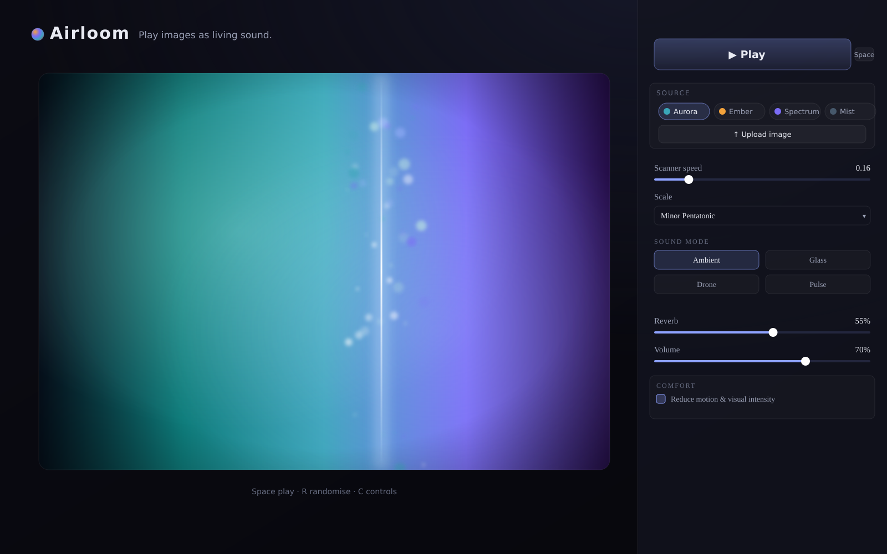

# Airloom

**Play images as living sound.** · *Scan colour. Hear light.*



Airloom is an experimental audio-visual instrument. Load an image (or a live
camera feed), press play, and a glowing scan line travels across it. As the
scanner passes over each slice of pixels, Airloom analyses colour, brightness
and saturation and weaves that data into evolving, atmospheric music — while
soft particle trails feel like sound being drawn out of the picture.

It is built to feel like a calm, premium art instrument rather than an image
editor or a synth utility.

---

## Quick start

```bash
npm install
npm run dev
```

Then open the printed local URL (usually http://localhost:5173).

Press **Play** (or the spacebar). Audio only ever starts after you interact —
nothing autoplays.

### Other scripts

```bash
npm run build      # type-check + production build into dist/
npm run preview    # preview the production build
npm run typecheck  # type-check only
```

Requires Node 18+.

---

## How to play

- **Press Play** (or `Space`) to start the scanner and sound.
- **Pick a demo image** from the chips, or **Upload** your own.
- **Use live camera** for an opt-in webcam mode (asks permission; click *Stop
  camera* to end it).
- Shape the sound with **scale**, **root note**, **sound mode**, **reverb**,
  **volume** and **scanner speed**.

### Keyboard shortcuts

| Key     | Action               |
| ------- | -------------------- |
| `Space` | Play / pause         |
| `R`     | Randomise demo image |
| `C`     | Toggle controls      |

---

## How the sound mapping works

Each slice of the image is reduced to perceptual values, then mapped to musical
parameters (see `src/utils/audioMapping.ts`, which is heavily commented):

| Image feature                | Musical result                                   |
| ---------------------------- | ------------------------------------------------ |
| **Hue**                      | Note (quantised to the selected scale)           |
| **Brightness**               | Note velocity / volume                           |
| **Saturation**               | Filter openness & harmonic richness              |
| **Red channel**              | Warmth — a low/sub oscillator blend              |
| **Green channel**            | Mid texture                                      |
| **Blue channel**             | Shimmer (high air) + reverb send                 |
| **Local contrast (edges)**   | Rhythmic accents / transients                    |

Pitches are always **quantised to a musical scale** (Minor Pentatonic, Major
Pentatonic, Dorian, Aeolian, or Chromatic) so the result sounds intentional
rather than random. The default — Minor Pentatonic in C, *Ambient* mode — is
soft and atmospheric.

**Sound modes:** *Ambient* (lush evolving pad), *Glass* (sparse bell tones),
*Drone* (a continuous gliding voice), *Pulse* (rhythmic, edge-driven).

---

## Architecture

```
src/
├─ App.tsx                  # Orchestrates state + the single animation heartbeat
├─ main.tsx
├─ types.ts                 # Shared TypeScript types
├─ components/
│  ├─ ImageStage.tsx        # The hero: image / camera + overlays
│  ├─ Scanner.tsx           # The glowing scan line (driven imperatively)
│  ├─ VisualTrails.tsx      # Particle trails canvas (self-contained RAF)
│  ├─ ControlsPanel.tsx     # Understated, collapsible controls
│  ├─ DemoImageSelector.tsx # Built-in generated images
│  ├─ CameraInput.tsx       # Opt-in live camera controls
│  └─ AudioEngine.ts        # Tone.js signal graph (not a component)
├─ hooks/
│  ├─ useImageCanvas.ts     # Offscreen canvas + cheap pixel sampling
│  ├─ useScanner.ts         # The requestAnimationFrame loop
│  ├─ useAudioMapping.ts    # Bridges analysis → AudioEngine on a musical clock
│  └─ useKeyboardShortcuts.ts
├─ utils/
│  ├─ colourAnalysis.ts     # RGB→HSL, per-slice analysis
│  ├─ scales.ts             # Scales, note/MIDI/frequency helpers
│  ├─ audioMapping.ts       # Pure colour → musical-parameter mapping
│  └─ demoImages.ts         # Procedurally generated demo images
└─ styles/global.css        # Dark, cinematic theme
```

**Design choices for stability & performance**

- Audio starts only inside a user gesture (browser autoplay-safe) and all Tone
  nodes are disposed on unmount.
- A **single** `requestAnimationFrame` loop drives the scan line, the audio
  clock and the trails; the scan line is positioned imperatively to avoid
  per-frame React re-renders.
- Notes trigger on a **steady musical clock**, not every frame, and only on
  note changes/accents in most modes — keeping the result musical, never harsh.
- A master **limiter** guards against clipping.
- Pixel reads use a small 256×160 offscreen canvas with coarse row sampling.
- Camera tracks are stopped when leaving camera mode and on unmount.

---

## Accessibility & comfort

- All controls are labelled and keyboard-usable; the sound mode is an ARIA
  radio group.
- Nothing relies on colour alone (text labels accompany every control).
- A **Reduce motion & visual intensity** toggle (auto-enabled when your system
  requests reduced motion) calms the visuals and scanner.
- Visuals are intentionally restrained by default — no harsh glitch effects.
- Live camera is strictly opt-in, with graceful handling of denied permission.

---

## Tech stack

Vite · React · TypeScript · Tone.js (Web Audio) · HTML Canvas. No backend.

> Note: Tone.js makes the JS bundle relatively large (~115 kB gzipped); this is
> expected for a Web Audio instrument.

---

## License

Released under the [MIT License](LICENSE). © 2026 bearduk.
